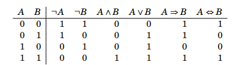
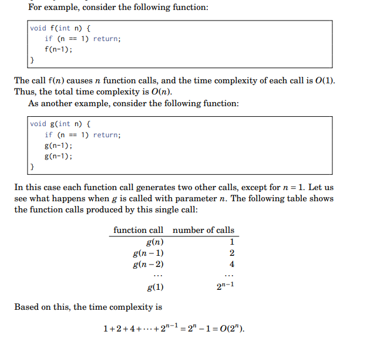
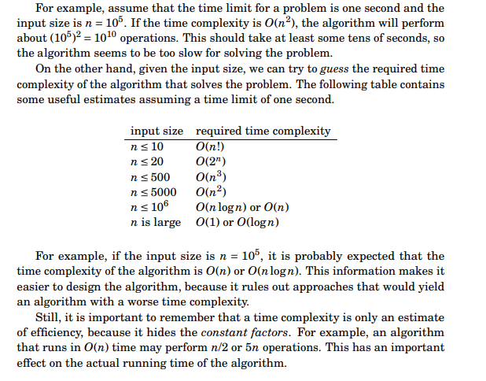
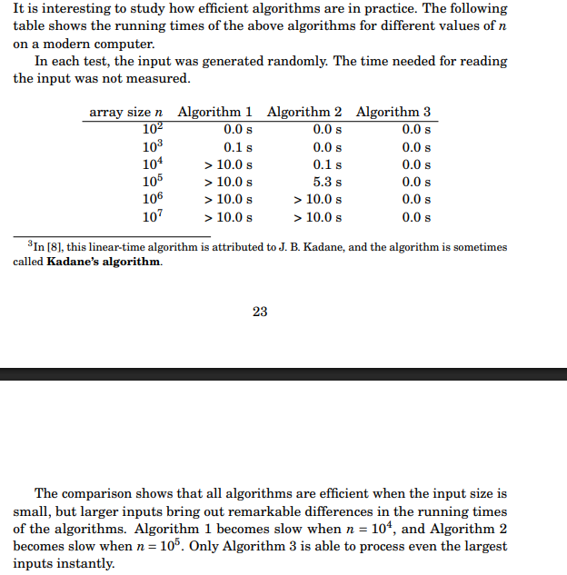

### Books

```
On Page 16

There are already some books (besides this book) that focus on competitive
programming and algorithmic problem solving:
• S. S. Skiena and M. A. Revilla: Programming Challenges: The Programming
Contest Training Manual [59]
• S. Halim and F. Halim: Competitive Programming 3: The New Lower Bound
of Programming Contests [33]
• K. Diks et al.: Looking for a Challenge? The Ultimate Problem Set from the
University of Warsaw Programming Competitions [15]
The first two books are intended for beginners, whereas the last book contains
advanced material.
Of course, general algorithm books are also suitable for competitive programmers. Some popular books are:
• T. H. Cormen, C. E. Leiserson, R. L. Rivest and C. Stein: Introduction to
Algorithms [13]
• J. Kleinberg and É. Tardos: Algorithm Design [45]
• S. S. Skiena: The Algorithm Design Manual [58]

```

# Chapter 1 Intro (Page 13 - Page 26)

- Summary of what the book is about with a small chat about programming languages, primarily C++

### C++ Basics

- C++ code template
- Input & output
- Working with numbers (float, integers)
- How to shorten code (macros, typedefs)

### Mathematics

**_Sum formulas:_**

- arithmetic progression
- geometric progression

**_Set theory:_**

- intersection
- union
- complement
- difference
- subsets

**_Logic expressions:_**

- Which are either true or false evaluated on the symbols below
- negation
- conjunction
- disjunction
- implication
- equivalence
- predicate
- quantifier
- Image has the first 5 of the symbols



**_Functions:_**

- floor (rounds down)
- ceiling functions (rounds up)
- min and max functions
- factorials
- Fibonacci number
- Binet's formula

**_Logarithms:_**

```
- logk(ab) = logk(a) + logk(b)
- logk(x^n) = n * logk(x)
- logk(a/b) = logk(a) - logk(b)
- logu(x) = logk(x) / logk(u)
- ln(x) -> the natural logarithm
```

# Chapter 2 Time Complexity (Page 27 - Page 34)

- The section starts off with time complexity which is an estimation of how much time an algorithm will use for some input. Helps gauge how efficient our algorithm is before implementation

### Calculation Rules

**_Loops:_**

- Each loop has a time complexity of `O(n^2)`
- If we nest loops `k` times then it will be `O(n^k)`
- Example below:

```cpp
// Time complexity of O(n)
for (int i = 1; i <= n; i++) {
	// code
}

// Time complexity of O(n^2)
for (int i = 1; i <= n; i++) {
	for (int j = 1; j <= n; j++) {
		// code
	}
}
```

**_Order of Magnitude:_**

- Time complexity is an estimation so it does not mention how many times something is executed
- An example is shown below. The code has a for loop that is `3 * n` but the the time complexity is `O(n)`

```cpp
for (int i = 1; i <= 3*n; i++) {
// code
}
```

**_Phases:_**

- If given a range of time complexities in an algorithm it is normally the largest that is taken as its normally the bottleneck.
- If we were given a file with three different loops having time complexities of `O(n),O(n^2),O(n^3)` then the total time complexity of the algorithm is `O(n^3)`

**_Several Variables:_**

- Time complexity can depend on several factors such as different variables
- An example below where the time complexity if `O(nm)` as the loops are defined by their respective variables:

```cpp
for (int i = 1; i <= n; i++) {
	for (int j = 1; j <= m; j++) {
	// code
	}
}
```

**_Recursion:_**

- Depends on the number of times the function is called and the time complexity of the the single call. The total time complexity is the product of these values
- Example below:



### Complexity Classes

**_O(1)_**

- The running time of a constant-time algorithm does not depend on the input size. Normally is a direct formula that calculates the answer
  **_O(log n)_**
- A logarithmic algorithm often halves the input size at each step. The running time of such an algorithm is logarithmic, because `log2n` equals the number of times n must be divided by 2 to get 1
  **_O( sqrt(n) )_**
- A square root algorithm is slower than `O(logn)` but faster than `O(n)`. A special property of square roots is that `sqrt(n) = n/sqrt(n)`, so the square root `sqrt(n)` lies, in some sense, in the middle of the input
  **_O(n logn)_**
- This time complexity often indicates that the algorithm sorts the input, because the time complexity of efficient sorting algorithms is `O(nlogn)`. Another possibility is that the algorithm uses a data structure where each operation takes `O(logn)` time.
  **_O(n^2)_**
- A quadratic algorithm often contains two nested loops. It is possible to go through all pairs of the input elements in `O(n^2)` time.
  **_O(n^3)_**
- A cubic algorithm often contains three nested loops. It is possible to go through all triplets of the input elements in `O(n^3)` time.
  **_O(2^n)_**
- This time complexity often indicates that the algorithm iterates through all subsets of the input elements. For example, the subsets of `{1,2,3}` are the empty set `{}  {1}, {2}, {3}, {1,2}, {1,3}, {2,3} and {1,2,3}`
  **_O(n!)_**
- This time complexity often indicates that the algorithm iterates through all permutations of the input elements. For example, the permutations of `{1,2,3} are (1,2,3), (1,3,2), (2,1,3), (2,3,1), (3,1,2) and (3,2,1)`

- Note an algorithm is polynomial if the time complexity is at most `O(n)^k` so all the time complexities other than `O(2^n) & O(n!)` are polynomial
- There are some algorithms which cannot be solved with a polynomial algorithm and cannot be solved efficiently which is `NP-Hard`

### Estimating Efficiency

- By calculating the time complexity of an algorithm, it is possible to check, before implementing the algorithm, that it is efficient enough for the problem



### Maximum Subarray Sum Example

- This has multiple algorithms where we go from a `O(n^3)` solution to `O(n^2)` to finally the `O(n)` solution
- Given an array of `n` numbers, calculate the **maximum subarray sum**, which is the largest sum of a sequence of consecutive values in the array. There may be negative numbers
- For example:

```
# We have an array as below
-1 2 4 -3 5 2 -5 2

# The following subarray produces a sum of 10
-1 [2 4 -3 5 2 -5] 2

# Here we can assume an empty subarray is allowed so the sum starts at 0 for this case
```

**_Algorithm 1:_**

- The straightforward way is to go through all possible subarrays, calculating the sum and maintaining the max sum

```cpp
// This solution is trying to set up bounds
// And then we check the inner contents for the max sum
int best = 0;
for (int a = 0; a < n; a++) {
	for (int b = a; b < n; b++) {
		int sum = 0;
		for (int k = a; k <= b; k++) {
			sum += array[k];
		}
		best = max(best,sum);
	}
}
cout << best << "\n";
```

- Variables `a` and `b` fix the `first` and `last` index of the subarray
- `sum` holds the sum of values
- `best` contains the max sum during the search
- Time complexity `O(n^3)` as there are three nested loops

**_Algorithm 2:_**

```cpp
int best = 0;
for (int a = 0; a < n; a++) {
	int sum = 0;
	for (int b = a; b < n; b++) {
		sum += array[b];
		best = max(best,sum);
	}
}
cout << best << "\n";
```

- We can remove a loop by checking the sum when moving the right end of the subarray moves

```
# Our right pointer moves constantly till the end calculating sums
# After we have done a full loop we shift our left pointer
1 2 6 8 -2

^ ^
| |
L R
```

**_Algorithm 3:_**

- The idea for this one is to calculate for each array position, the max sum of a subarray that ends at that position
- We then consider a subproblem of finding the max sum subarrays that ends at position `k` with two possibilities
  1.  The subarray only contains element at position `k`
  2.  Subarray consists of a subarray that ends at position `k-1` followed by the element at position `k`
- For `Case (2)` the subarray that ends at position `k - 1` should also have a max sum. Hence we can find the max sum based on the ending position
- The time complexity for this is `O(n)`

```cpp
int best = 0, sum = 0;
for (int k = 0; k < n; k++) {
	sum = max(array[k],sum+array[k]);
	best = max(best,sum);
}
cout << best << "\n";
```

**_Efficiency Comparison_**



# Chapter 3 Sorting (Page 35 - Page ?)
